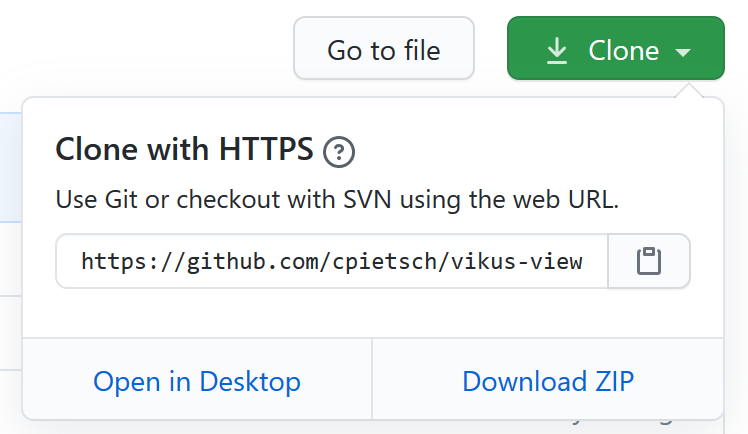

<!-- .element class="aligned-center title-page" -->

# Ansprechende Visualisierungen mit dem Vikus Viewer

- - -

<!-- .element width="50%" -->
https://github.com/cpietsch/vikus-viewer

---

## Vikus Viewer

[Vikus Viewer](https://vikusviewer.fh-potsdam.de/) ist eine Javascript-Bibliothek 
zur Darstellung von Sammlungen in einer bestimmten Form.

Sie ist entstanden im Projekt [Visualisierung Kultureller Sammlungen (VIKUS)](https://uclab.fh-potsdam.de/projects/vikus/) der FH Potsdam.

Beispiele:

[Vergangene Visionen / Friedrich Wilhelm IV.](https://vikusviewer.fh-potsdam.de/fw4/)

[Art of the March](https://vikusviewer.fh-potsdam.de/artofthemarch/)

---

## Eigenschaften

+ Ansprechende graphische Aufmachung "out-of-the-box"
+ Open source
+ klein, überschaubar, direkt

<!-- .element style="color:green" -->

- Aufsetzen und Datenaufbereitung erfordern Technikkenntnisse
- Darstellung setzt Datenbeständen klare Grenzen

<!-- .element style="color:red" -->

---

## (Meta-)Datenmodell

- Bild / Digitalisat
- Datumsangabe
- Schlagwörter

- weitere Metadaten
- Info-Texte zu Datumsangaben
- Beschreibung

---

## Briefsammlung Trew als Beispiel-Datensatz

Komplette Briefsammlung von der UB
[katalogisiert und digitalisiert](http://digital.bib-bvb.de/R/?func=collections&collection_id=2397&local_base=UBE)

correspsearch-Index [verfügbar](https://ub.fau.de/pub/briefsammlung_trew.cmif.xml)

**Ziel:** Briefe von 1500-1549 mit dem [Vikus Viewer](http://dhlab.ub.fau.de/vikus-trew/) präsentieren

Herausforderungen:

- Kaum Metadaten
- Keine Schlagwörter

---

## Vikus Viewer verwenden

(Kurz-)Dokumentation im [Vikus-GitHub-Repositorium](https://github.com/cpietsch/vikus-viewer)

- Bibliothek herunterladen
- Web-Server aufsetzen
- Daten anpassen
- Bilddaten kompilieren
- Konfiguration anpassen
- (Darstellung anpassen)

---

### Bibliothek herunterladen

Das Repositorium des Vikus Viewer umfasst

- die Javascript-Bibliothek
- Beispiel-Konfig-Dateien
- 

Wir laden das letzte Release herunter.

---

### Web-Server aufsetzen

Webserver ist nötig!

Produktivbetrieb:
- "echter" Server, z.B. Apache (auch VM)
- Teil einer Webpräsenz, z.B. Wordpress

Testen / persönlicher Betrieb:
- [XAMPP](https://www.apachefriends.org/de/index.html)
- [MiniWeb HTTP Server](http://miniweb.sourceforge.net/)
- ...

---

### Daten anpassen

Vikus Viewer erwartet eine CSV-Datei mit bestimmter Spaltenanordnung / Datenwerten.

- Shell-Skripte
- OpenRefine
- Excel
- ...
- (händisch)

Trew-Briefe: Wie an Bild zu Metadatensatz gelangen? => Crawlen

---

### Bilddaten kompilieren

In einem [separaten Repositorium]() sind Skripte hinterlegt, die die
"rohen" Bilder in die Größen  und Formate umwandelt, die Vikus braucht.

Auch hier ist wieder kurz dokumentiert, wie zu verfahren ist.

**Achtung:** 
Das Skript benötigt NodeJS und NPM. Beides muss evtl. zunächst installiert werden.

---

### Konfiguration anpassen

Im `data`-Verzeichnis müssen die Konfigurationsdateien erstellt werden:

- `config.json`: dazu Beispiel heranziehen
- `info.md` mit Text befüllen
- `timeline.csv`: Leere Datei erstellen (nur Spaltennamen)
- `data.csv`: dorthin kopieren

In der `config.json` gibt es einige Parameter, die das Aussehen steuern...

---

